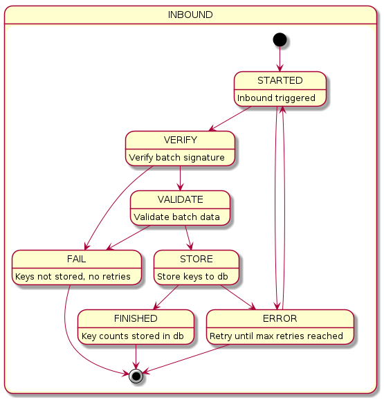
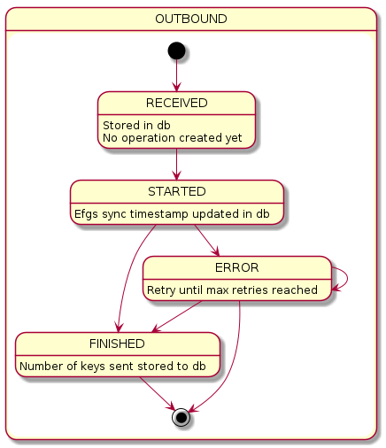

## :warning: This project has been terminated and is no longer actively maintained: project has been archived and any usage should be done with caution! :warning:

# Exposure Notification Service for the Finnish COVID-19 Application

## Maintenance

### Properties
Full set of usable properties can be viewed in `src/main/resources/application.yml`

The most relevant and environment-specific properties are provided as ENV variables, prefixed with `EN_`.
* The main REST API listening port: `EN_SERVER_PORT`
* Port for monitoring services via Spring Actuator: `EN_MANAGEMENT_SERVER_PORT` 
* Database connection parameters: `EN_DATABASE_URL`, `EN_DATABASE_USERNAME`, `EN_DATABASE_PASSWORD`
* Demo-mode activation (distribute also keys of current batch immediately, default false): `EN_DEMO_MODE`
* Local directory for caching batch files (defaults to a temp-directory): `EN_FILES`
* Address for reaching the publish-token service for token verification: `EN_PT_URL`
* Private key for signing diagnosis batches (see details below): `EN_SIGNING_PRIVATE_PKCS8`
* The signature version number (eg. v1 for testing, v2 for production): `EN_SIGNING_VERSION`
* Logback additional configuration: `EN_ROOT_LOG_LEVEL`, `EN_FI_THL_LOG_LEVEL`, `EN_LOG_INCLUDE`

### Database
The service is built to use PostgreSQL database, version 12. 

The service automatically creates and migrates the schema (named `en`) on startup, using Flyway. 
If there are incompatible migrations, the startup will fail. 

Connection parameters are given as environment variables (see above).

### Monitoring
The services uses Spring Actuator to provide basic monitoring information.

In addition, logs should be used to identify issues. The principle of log levels in the service:
* `ERROR`: Something broke that shouldn't have. These should never appear normally. Each one is worth investigating.
* `WARN`: Something went wrong, but the situation is handled. These can be expected to happen, but if some warnings start spiking, it could be worth investigation.
* `INFO`: Normal runtime logging of expected events.
* `DEBUG`: Detailed logs of execution, only interesting in special cases.

`DiagnosisKeyController` logs all validated incoming requests on `INFO` level. 
This can be used to see what comes through for processing.

`ApiErrorHandler` logs all failed requests. 
The level is `WARN` if it's an "expected" issue, like client-side errors (403, 400, etc.) and `ERROR` if it's something unexpected (typically 500).

`DiagnosisKeyDao` logs all database operation on `INFO` level. 
When returning data from cache, those loggings are left out, so this should correspond to real DB traffic.

`BatchFileStorage` logs writing and deleting batch files to disk cache.

`MaintenanceService` logs numeric information about background tasks that clean up old data and pre-cache batches.

In addition, for class level logging, Mapped Diagnostic Context (MDC) is used to add pseudorandom correlation identifier (correlationId)
to every log message. CorrelationId binds all individual log messages of request flow together. For compatibility reasons,
correlationId is called errorId in http-responses.
If the client provides a user-visible error and errorId from response, it can be used to find the corresponding issue in the logs.

## Signing Keys
The diagnosis key batches are signed, so that the application can ensure that they come from a trusted source. 
The EN API requires the key to be ECDSA P-256 curve using the SHA256 hash function.

The public part of this signing key needs to be delivered to Google & Apple through official channels. 
Here, versions are differentiated with version numbers (eg. v1 for testing v2 for production).

The private part of the key should be kept secret. 
It is provided to the service through an environment variable (see above), along with the version number.

### Key Generation
Creating the key, as instructed by Google.
```
openssl ecparam -genkey -name prime256v1 -out​key​.pem
```

Java libraries want the private part in PKCS8, so convert it and provide this (the Base64-encoded PCKS8 key data) to the service as environment variable (see above).
```
openssl pkcs8 -topk8 -nocrypt -in key.pem -out key_pkcs8.pem
```

This is how you get the public part for Google and Apple.
```
openssl ec -in key_pkcs8.pem -pubout
```

### Temporary Dev Keys
If you just want to run the service and don't plan on verifying the signature, you can launch the service with argument `-Dcovid19.diagnosis.signature.randomize-key=true`.
This will generate a new key-pair on each launch, printing out the public part into log. 

## Caching
There are several forms of cache used by the application and can be configured through the application.yml.
Configurable values use [Duration parsing rules](https://docs.oracle.com/javase/8/docs/api/java/time/Duration.html#parse-java.lang.CharSequence-).
1. Response cache at Proxy: Intermediate proxies can and should listen to the Cache-Control headers that give caching times as public. Most of the data doesn't change often, so common queries are cached thus.
    * covid19.diagnosis.response-cache.config-duration: Config API fetches for AppConfig & ExposureConfig
    * covid19.diagnosis.response-cache.status-duration: Diagnosis API fetches for list, current & status
    * covid19.diagnosis.response-cache.batch-duration: Diagnosis API fetches for batch files
1. Batch file cache at filesystem: All batch files are pre-generated into a local filesystem so they can be quickly served, even if the request gets past the cache.
1. Data access cache in RAM: Some status requests will always get through the proxy caches, so the most common database queries are cached in service RAM to ensure rapid responses.
    * covid19.diagnosis.data-cache.status-duration: database fetches needed for configuration or status information

## European Federation Gateway Service (EFGS) integration

EFGS is an official European solution for interoperability between European national COVID19 application backend servers.
EFGS allows national backends to change keys, which effectively means that national COVID-19 mobile tracing apps are compatible with each other.
More information, source code and api definition of EFGS can be found from GitHub: https://github.com/eu-federation-gateway-service/efgs-federation-gateway.

### EFGS related properties

Full list of application properties can be found from application.yml and application-dev.yml under federation-gateway subtopic.
Latter is optimized for local development and automated tests.

For easier maintenance and security there are some environment variables which are read by application on startup.

* Enable/disable scheduled synchronization of keys (true/false) `EN_EFGS_SYNC_ENABLED`
* Enable/disable scheduled inbound for keys (true/false) `EN_EFGS_SCHEDULED_INBOUND_ENABLED`
  * if `EN_EFGS_SYNC_ENABLED` is set to false, then this option will be ignored
* Enable/disable EFGS callback based inbound for keys (true/false) `EN_EFGS_CALLBACK_ENABLED`
  * usually if this is set to true, then `EN_EFGS_SCHEDULED_INBOUND_ENABLED` should be set as false, but for flexibility this is not forced.
* EFGS endpoint for diagnosiskey-api e.g. https://efgs-test.eu/diagnosiskey (string) `EN_EFGS_URL`
* Local endpoint for callback requests made from EFGS server e.g. https://local-test.fi (string) `EN_EFGS_CALLBACK_URL`
* Interval to send keys to efgs `EN_EFGS_UPLOAD_INTERVAL`

### Logging 

Same principles, stated in the monitoring section, applies also with efgs-integration. However, there is some details,
which are worth to mention separately.

With efgs-integration there are two operation tables: *efgs_outbound_operation* an *efgs_inbound_operation*. Both of these
*always* have some state. 

Operation state have three possible values: STARTED, FINISHED and ERROR.

* STARTED: operation is running (or hanged in a case of application crash, this will be resolved automatically)
* FINISHED: operation is finished
* ERROR: operation has resulted an error. In a case of INBOUND operation, operation retry times have fixed maximum.
For OUTBOUND, new operation will be created on next cycle and retry counter is stored for each key separately.
  
There is also a couple of counters for results of processing:

* efgs_outbound_operation
  * keys_count_total: total number of keys bound to this operation
  * keys_count_201: total number of successfully processed keys bound to this operation
  * keys_count_409: total number of keys with http-status 409 bound to this operation
  * keys_count_500: total number of keys with http-status 500 bound to this operation
    
* efgs_inbound_operation
  * keys_count_total: total number of keys bound to this operation
  * keys_count_success: total number of successfully processed keys bound to this operation
  * keys_count_not_valid: total number of invalid keys bound to this operation
  * invalid_signature_count: total number of keys which are failing when verifying signature and are bound to this operation 

Also, operation has a field for batch tag, which is used as an identifier between efgs and koronavilkku backend. Outbound and
inbound batch tags do not have any relation between each other i.e. batches from efgs could contain multiple national batches.

Batch tag or operation id is used for MDC logging, so there are three log properties which are added to every log row resulted from
individual operation. So, these can be used for further investigations to get all the log rows for a some specific operation.

* outboundOperationId: operation id of upload operation
* callbackBatchTag: batch tag of inbound operation which are triggered by callback
* scheduledInboundBatchTag: batch tag of inbound operation which are triggered by scheduler
* inboundRetryBatchTag: batch tag of inbound operation which are triggered by error handler

### Interchange of keys

Same database table will be used for keys from other national backends than which is used for local keys. Consent of
user willingness to share keys with other national backends will be stored on each individual key. Same applies to
user provided data of visited countries.  



* Inbound keys will be verified and validated on reception and then mixed with local keys in the database
  * Inbound operation will be made based on callback request when it arrives or once in a day after UTC midnight
  * Keys can be separated on the database level by origin field. Origin will not be sent to the mobile app. The mobile app sees
  all keys coming with region FI, which in this context refers to region of national server, not the actual keys.
  * More information about verification can be found e.g from [EFGS documentation of certificate governance](https://ec.europa.eu/health/sites/health/files/ehealth/docs/mobileapps_interop_certificate_governance_en.pdf)



* Outbound keys received from local mobile app which are not yet send to EFGS will be send on next scheduled outbound run
  * Outbound interval is specified in application.yml with `upload-interval` parameter
* Both outbound and inbound operations will be retried in a case of error. Max retries is defined by fixed value.
  * Retry interval is specified in application.yml with `error-handling-interval` parameter  
* Metadata of all operations will be stored into the database including number of received or sent keys

## Configuration API
API for retrieving exposure configuration parameters as defined in:
* [Google documentation](https://developers.google.com/android/exposure-notifications/exposure-notifications-api#data-structures)
* [Apple documentation](https://developer.apple.com/documentation/exposurenotification/enexposureconfiguration)

Participating countries is populated (mainly) from here: https://ec.europa.eu/info/live-work-travel-eu/health/coronavirus-response/travel-during-coronavirus-pandemic/mobile-contact-tracing-apps-eu-member-states_en

### About Config Versions
Configuration API responses (AppConfiguration & ExposureConfiguration) return objects with version numbers. 
The API user should store these objects and request new ones using the version of the previously received configuration.
If the response comes back empty, the previously stored configuration is up-to-date and can be used as-is. 
If a config is returned, it should be stored and used instead.

### Get Exposure Configuration V1
* **Cache:** This data changes unpredictably, but not often. Cacheable for 1h.
* **URL:** `/exposure/configuration/v1`
* **Method:** `GET`
* **URL Params:** None 
* **Query Params:** 
  * (Optional) previous: The version number of the previous exposure configuration the client has received. Empty for new client.  
* **Request Body:** None
* **Success Response:**
  * Configuration has been updated 
    * Status: 200 OK
    * Body: JSON ExposureConfiguration object, adjusted from the Google/Apple definitions
        ```json
        {
          "version": 1,
          "minimumRiskScore": 1,
          "attenuationScores": [0,5,5,5,5,5,5,5],
          "daysSinceLastExposureScores": [1,1,1,1,1,1,1,1],
          "durationScores": [0,0,0,0,5,5,5,5],
          "transmissionRiskScores": [1,1,1,1,1,1,1,1],
          "transmissionRiskScoresAndroid": [1,1,1,1,1,1,1,1],
          "durationAtAttenuationThresholds": [50,70],
          "durationAtAttenuationWeights": [1.0, 0.5, 0.0],
          "exposureRiskDuration": 15,
          "participatingCountries": ["DK","DE","IE","IT","LV","ES"]
        }
        ```
  * Configuration is already up to date
    * Status: 204 No Content

### Get Exposure Configuration V2
* **Cache:** This data changes unpredictably, but not often. Cacheable for 1h.
* **URL:** `/exposure/configuration/v2`
* **Method:** `GET`
* **URL Params:** None
* **Query Params:**
    * (Optional) previous: The version number of the previous exposure configuration the client has received. Empty for new client.
* **Request Body:** None
* **Success Response:**
    * Configuration has been updated
        * Status: 200 OK
        * Body: JSON ExposureConfiguration object, adjusted from the Google/Apple definitions
            ```json
            {
              "version":1,
              "reportTypeWeightConfirmedTest":1.0,
              "reportTypeWeightConfirmedClinicalDiagnosis":0.0,
              "reportTypeWeightSelfReport":0.0,
              "reportTypeWeightRecursive":0.0,
              "infectiousnessWeightStandard":1.0,
              "infectiousnessWeightHigh":1.5,
              "attenuationBucketThresholdDb":[55,70,80],
              "attenuationBucketWeights":[2.0,1.0,0.25,0.0],
              "daysSinceExposureThreshold":10,
              "minimumWindowScore":1.0,
              "minimumDailyScore":900,
              "daysSinceOnsetToInfectiousness":
                {
                  "-14":"NONE",
                  "-13":"NONE",
                  "-12":"NONE",
                  "-11":"NONE",
                  "-10":"NONE",
                  "-9":"NONE",
                  "-8":"NONE",
                  "-7":"NONE",
                  "-6":"NONE",
                  "-5":"NONE",
                  "-4":"NONE",
                  "-3":"NONE",
                  "-2":"STANDARD",
                  "-1":"HIGH",
                  "0":"HIGH",
                  "1":"HIGH",
                  "2":"HIGH",
                  "3":"HIGH",
                  "4":"STANDARD",
                  "5":"STANDARD",
                  "6":"STANDARD",
                  "7":"STANDARD",
                  "8":"STANDARD",
                  "9":"STANDARD",
                  "10":"STANDARD",
                  "11":"NONE",
                  "12":"NONE",
                  "13":"NONE",
                  "14":"NONE"
                },
              "infectiousnessWhenDaysSinceOnsetMissing":"STANDARD",
              "availableCountries":["DE","NO","BE","PT","BG","DK","LT","LU","HR","LV","FR","HU","SE","SI","SK","GB","IE","EE","CH","MT","IS","GR","IT","ES","AT","CY","CZ","PL","RO","LI","NL"]
            }
            ```
    * Configuration is already up to date
        * Status: 204 No Content

## Diagnosis API
API for posting Temporary Exposure Keys after a positive diagnosis as per 
* [Google Documentation for the API](https://developers.google.com/android/exposure-notifications/exposure-notifications-api)
* [Apple Documentation for the API](https://developer.apple.com/documentation/exposurenotification/setting_up_an_exposure_notification_server)

### About Batch IDs
The API relies on remembering current state of processing via batch IDs. 
From client perspective, these are only strings; don't parse or interpret them in any way. The back-end has full freedom to change the form of the IDs, so long as the API continues to function. 
Despite this, the batches do have an order and must be processed in the order given by backend, remembering the last successfully processed ID.

### Fetch the Batch ID for the Latest Diagnosis Key Batch
New clients that have yet to process anything should call this to get the server's current batch  ID for further `/diagnosis/list` requests. 
This batch does not need to be processed, as the new client should not have any encounters yet and hence cannot be exposed.
* **Cache:** This reply changes once per day, but the exact time is not set in stone.
* **URL:** `/diagnosis/v1/current`
* **Method:** `GET`
* **URL Params:** None 
* **Query Params:**
    * (Optional) en-api-version: Possible value is 2. Defaults to 1. If value is != 2 or parameter is missing, default value will be used. This should match en api version used in client to get compatible batches.
* **Request Body:** None
* **Success Response:** 
  * Status: 200 OK
  * Body: a JSON object holding the latest batch ID
      ```json
      { "current": "12345679" }
      ```
    
### List Diagnosis Key Batches
Clients should periodically fetch the latest key batches, using this method to know if there is anything new to download.
The list <u>needs to be processed in the order it is given</u>, remembering the last successfully handled batch ID for the next list request. 
* **Cache:** This reply changes once per day, but the exact time is not set in stone.
* **URL:** `/diagnosis/v1/list`
* **Method:** `GET`
* **URL Params:** None 
* **Query Params:** 
  * (Mandatory) previous: the batch-id of the previous processed batch. If missing (new client), the client should request a batch  ID with `/diagnosis/current` first.
  * (Optional) en-api-version: Possible value is 2. Defaults to 1. If value is != 2 or parameter is missing, default value will be used. This should match en api version used in client to get compatible batches.
* **Request Body:** None
* **Success Response:** 
  * New content exists: 
    * Status: 200 OK
    * Body: A JSON object holding an <u>Ordered list</u> of batch IDs for fetching the files
      ```json
      { "batches": [ "12345678", "12345679" ] }
      ```
  * No new content exists: 
    * Status: 204 No content

### Status API
Status API is a one-call replacement for diagnosis key current & list fetches as well as the configuration fetch.
* **Cache:** This reply changes once per day, but the exact time is not set in stone.
* **URL:** `/diagnosis/v1/status`
* **Method:** `GET`
* **URL Params:** None 
* **Query Params:** 
  * (Optional) batch: the batch-id of the previous processed batch. Leave out if new client.
  * (Optional) app-config: the version of the previous AppConfiguration the client has received. Leave out if new client.
  * (Optional) exposure-config: the version of the previous ExposureConfiguration the client has received. Leave out if new client.
  * (Optional) exposure-config-v2: the version of the previous ExposureConfiguration V2 the client has received. Leave out if new client.
  * (Optional) en-api-version: Possible value is 2. Defaults to 1. If value is != 2 or parameter is missing, default value will be used. This should match en api version used in client to get compatible batches.  
* **Request Body:** None
* **Success Response:** 
  * Status: 200 OK
  * Body: A JSON object containing:
    * batches: An <u>Ordered list</u> of batch IDs that the client should fetch. Empty list if nothing needs to be done.
    * appConfig: (Optional) The latest AppConfiguration, if it's been updated since the version given in app-config (or if no version was given). Empty if that version is still current.
    * exposureConfig: (Optional) The latest ExposureConfiguration, if it's been updated since the version given in exposure-config (or if no version was given). Empty if that version is still current.
    * A full sample where there are 2 new batches and both configs have changed:
      ```json
      { 
        "batches": [ "12345678", "12345679" ],
        "appConfig": {
          "version": 1,
          "tokenLength": 12,
          "diagnosisKeysPerSubmit": 14,
          "pollingIntervalMinutes": 240,
          "municipalityFetchIntervalHours": 48,
          "lowRiskLimit": 96,
          "highRiskLimit": 126 
        },
        "exposureConfig": {
          "version": 1,
          "minimumRiskScore": 1,
          "attenuationScores": [0,5,5,5,5,5,5,5],
          "daysSinceLastExposureScores": [1,1,1,1,1,1,1,1],
          "durationScores": [0,0,0,0,5,5,5,5],
          "transmissionRiskScores": [1,1,1,1,1,1,1,1],
          "durationAtAttenuationThresholds": [50,70]
        }
      }
      ```
    * A minimal sample where there's nothing to update:
      ```json
      { 
        "batches": [],
        "appConfig": null,
        "exposureConfig": null
      }
      ```

### Fetching a Single Diagnosis Key Batch
* **Cache:** This data never changes, but after 14 days of initial submit, it should no-longer be available.
* **URL:** `/diagnosis/v1/batch/{batch_id}`
* **Method:** `GET`
* **URL Params:** 
  * batch_id: the batch  ID, as provided by "List Diagnosis Key Batches" 
* **Query Params:** None
* **Request Body:** None
* **Success Response:**
  * Status: 200 OK
  * Body: The zip-file as specified in [Google Documentation for the file format](https://developers.google.com/android/exposure-notifications/exposure-key-file-format)
* **Failure Response:**
  * Such a batch is not available
    * Status: 404 Not Found

### Publishing Temporary Exposure Keys After a Positive Diagnosis of COVID-19
* **Cache:** None
* **URL:** `/diagnosis/v1`
* **Method:** `POST`
* **URL Params:** None
* **Query Params:** None
* **Headers:**
  * (Mandatory) `KV-Publish-Token`
    * Token received from health authority after verifying the infection 
    * In production mode, this is mandatory 
  * (Mandatory) `KV-Fake-Request`
    * 1 if sending a fake request. It will be validated for format, but token does not need to be real and nothing will be stored.
    * 0 if sending an actual save request. Token must be valid or the request will fail.
* **Request Body:**
  * keys: List of TemporaryExposureKey objects, as per [the API docs](https://developers.google.com/android/exposure-notifications/verification-system#metadata)
    * <u>Note, that the key data bytes need to be base64 encoded</u>
    * <u>Note, for visitedCountries and consentToShareWithEfgs value is boolean, use 1 for true and 0 for false</u>
  * Sample Body 
    ```json
    {
      "keys": [{ 
          "keyData": "c9Uau9icuBlvDvtokvlNaA==",
          "transmissionRiskLevel": 5,
          "rollingStartIntervalNumber":  123456,
          "rollingPeriod": 144
        }, { 
          "keyData": "/MwsNfC4Rgnl8SxV3YWrqA==",
          "transmissionRiskLevel": 5,
          "rollingStartIntervalNumber":  123456,
          "rollingPeriod": 144
        }],
      "visitedCountries": {"DE":1,"IT":0},
      "consentToShareWithEfgs": 1
    }
    ```
* **Success Response:**
  * Status: 200 OK

### Callback api
Callback api is used to inform application that new batch is available to fetch. Requests should be secured with mTLS.
* **URL:** `/efgs/callback?batchTag={batchTag}&date={date}`
* **Method:** `GET`
* **URL Params:** None
* **Query Params:**
  * batchTag: the batch tag of newly available batch 
  * date: UTC date of batchTag as string in ISO-8601 format e.g. *2020-11-24* 
* **Request Body:** None
* **Success Response:**
  * Status: 202 Accepted
  * Body: Current status of request as string
* **Failure Response:**
  * Callback service is disabled in application
    * Status: 503 Service unavailable
  * Such a processing queue is full
    * Status: 500 Internal server error
